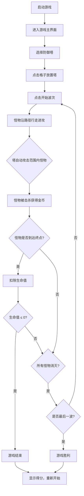

## 1. 产品概述

一款使用 Three.js 3D 渲染的几何体塔防游戏。所有怪物和塔都由不同颜色、不同形状的几何体（立方体、棱锥、圆柱、球体等）替代传统角色模型，营造出复古未来主义的街机风格。玩家在网格地图上放置防御塔，抵御一波波几何体怪物的进攻。

## 2. 核心功能

### 2.1 功能模块

1. **游戏主界面**：3D 战场地图、怪物路径、防御塔放置、HUD（生命、金币、波次、分数）
2. **游戏结束界面**：得分展示、重新开始按钮
3. **游戏胜利界面**：通关庆祝、最终得分、重新开始

### 2.2 页面详情

| 页面名称 | 模块名称 | 功能描述 |
|---------|---------|---------|
| 游戏主界面 | 3D 战场 | 俯视视角的网格地图，含怪物行进路径、可放置塔的格子，所有元素由几何体构成 |
| 游戏主界面 | 塔选择面板 | 底部 UI 面板，展示可选塔类型（几何体+颜色），点击后进入放置模式 |
| 游戏主界面 | HUD 信息栏 | 顶部显示当前波次、剩余生命、金币数量、当前得分 |
| 游戏主界面 | 波次控制 | 自动波次生成，每波怪物数量递增，速度递增 |
| 游戏结束界面 | 结算面板 | 显示最终得分、击杀数、波次，提供重新开始按钮 |
| 游戏胜利界面 | 胜利面板 | 庆祝效果、最终得分、重新开始按钮 |

## 3. 核心流程

## 4. 用户界面设计

### 4.1 设计风格

- **主题**：复古未来主义街机风格 — 暗色背景 + 霓虹发光几何体
- **主色调**：深空蓝黑背景 `#0a0a1a`，霓虹青 `#00f0ff`、霓虹紫 `#b44dff`、霓虹粉 `#ff2d95`
- **辅助色**：金色 `#ffd700` 用于金币，红色 `#ff3333` 用于伤害/危险
- **字体**：`'Press Start 2P'` 用于标题和 HUD 数字，`'Orbitron'` 用于 UI 面板文字
- **布局风格**：全屏 3D 画布 + 底部覆盖式 UI 面板
- **几何体风格**：纯色发光几何体，边缘带发光描边（emissive + outline），所有角色均由基本几何体组合构成

### 4.2 怪物几何体设计

| 怪物类型 | 几何体形状 | 颜色 | 尺寸 | 生命 | 速度 | 金币奖励 |
|---------|-----------|------|------|------|------|---------|
| 小方块 | 立方体 BoxGeometry | 霓虹绿 `#00ff88` | 0.6 | 100 | 1.0 | 10 |
| 棱锥怪 | 四面体 TetrahedronGeometry | 霓虹橙 `#ff6600` | 0.7 | 200 | 0.8 | 20 |
| 圆柱兽 | 圆柱体 CylinderGeometry | 霓虹粉 `#ff2d95` | 0.7 | 350 | 0.7 | 30 |
| 球体王 | 球体 SphereGeometry | 霓虹紫 `#b44dff` | 0.9 | 600 | 0.5 | 50 |
| 星形 Boss | 二十面体 IcosahedronGeometry | 金色 `#ffd700` | 1.2 | 1500 | 0.4 | 100 |

### 4.3 防御塔几何体设计

| 塔类型 | 几何体形状 | 颜色 | 攻击范围 | 伤害 | 射速 | 造价 |
|--------|-----------|------|---------|------|------|------|
| 箭塔 | 圆锥体 ConeGeometry | 霓虹青 `#00f0ff` | 2.5 | 25 | 1.0/s | 50 |
| 炮塔 | 立方体 BoxGeometry | 霓虹红 `#ff3333` | 2.0 | 60 | 0.5/s | 100 |
| 冰塔 | 八面体 OctahedronGeometry | 冰蓝 `#66ccff` | 2.2 | 15 | 1.2/s | 75 |
| 雷塔 | 菱形十二面体 DodecahedronGeometry | 霓虹黄 `#ffff00` | 3.0 | 40 | 0.8/s | 150 |

### 4.4 响应式设计

- 桌面端优先，3D 画布自适应窗口大小
- 底部 UI 面板使用固定定位，移动端适配触摸操作

### 4.5 3D 场景指引

- **环境**：深色背景，网格地面（GridHelper），路径用发光线条标记
- **光照**：环境光 + 定向光 + 塔/怪物自发光材质
- **相机**：等距俯视视角（isometric），支持鼠标滚轮缩放和右键旋转
- **动画**：怪物行走时几何体旋转滚动，塔攻击时短暂缩放脉冲，弹丸飞行轨迹
- **后处理**：简单的发光效果（可选，保持性能）