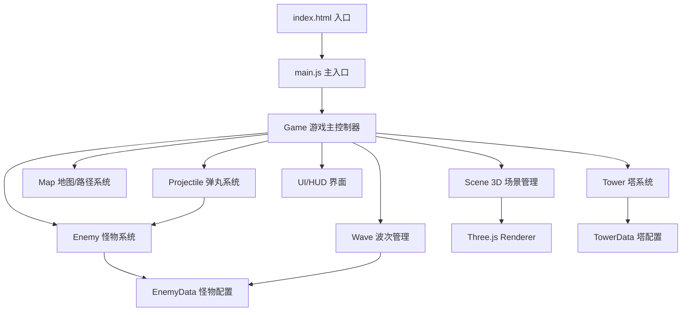

## 1. 架构设计



## 2. 技术描述

- **前端框架**：原生 HTML/CSS/JS + Three.js（CDN 引入），无需构建工具
- **3D 渲染**：Three.js r160+（CDN）+ OrbitControls
- **样式方案**：原生 CSS + Google Fonts
- **状态管理**：Game 类内部状态对象，无外部状态库
- **后端**：无，纯前端单页游戏
- **数据存储**：无持久化，内存中管理游戏状态

## 3. 路由定义

单页应用，无路由。所有游戏状态通过 UI 面板切换展示：
- 游戏状态：`menu` → `playing` → `gameover` / `victory`

## 4. 核心数据结构

### 4.1 怪物配置

```typescript
interface EnemyConfig {
  type: string;       // 类型名称
  geometry: string;   // 几何体类型: 'box' | 'tetrahedron' | 'cylinder' | 'sphere' | 'icosahedron'
  color: string;      // 颜色
  size: number;       // 尺寸
  hp: number;         // 生命值
  speed: number;      // 速度
  reward: number;     // 击杀金币
}
```

### 4.2 防御塔配置

```typescript
interface TowerConfig {
  type: string;       // 类型名称
  geometry: string;   // 几何体类型: 'cone' | 'box' | 'octahedron' | 'dodecahedron'
  color: string;      // 颜色
  range: number;      // 攻击范围
  damage: number;     // 伤害
  fireRate: number;   // 射速（发/秒）
  cost: number;       // 造价
}
```

### 4.3 游戏状态

```typescript
interface GameState {
  lives: number;       // 生命值
  gold: number;        // 金币
  score: number;       // 得分
  wave: number;        // 当前波次
  gameStatus: string;  // 'menu' | 'playing' | 'gameover' | 'victory'
  towers: PlacedTower[];
  enemies: ActiveEnemy[];
  projectiles: Projectile[];
}
```

### 4.4 地图数据

```typescript
interface MapData {
  gridSize: number;          // 网格大小
  path: [number, number][];  // 路径坐标数组
  placeableTiles: boolean[][]; // 可放置塔的格子
}
```

## 5. 文件结构

```
/workspace/
├── index.html          # 主入口，HTML 结构 + UI 面板
├── css/
│   └── style.css       # 全局样式 + UI 样式
├── js/
│   ├── main.js         # 初始化入口
│   ├── Game.js         # 游戏主控制器
│   ├── Scene.js        # Three.js 场景管理
│   ├── Map.js          # 地图/路径/网格
│   ├── Tower.js        # 塔类 + 塔配置
│   ├── Enemy.js        # 怪物类 + 怪物配置
│   ├── Wave.js         # 波次管理
│   ├── Projectile.js   # 弹丸类
│   └── UI.js           # HUD 和面板 UI 管理
└── .trae/
    └── documents/
        ├── prd.md
        └── tech-architecture.md
```